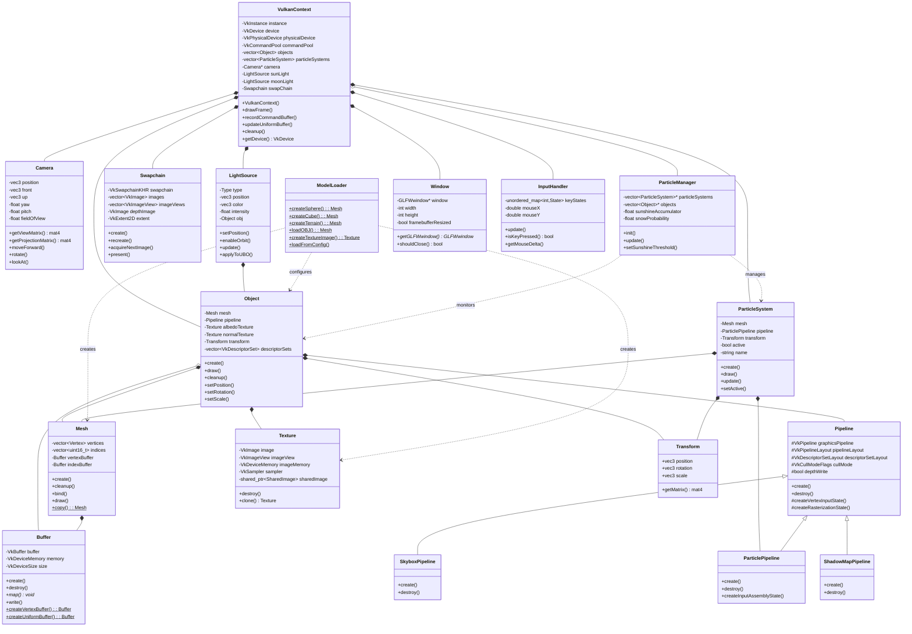
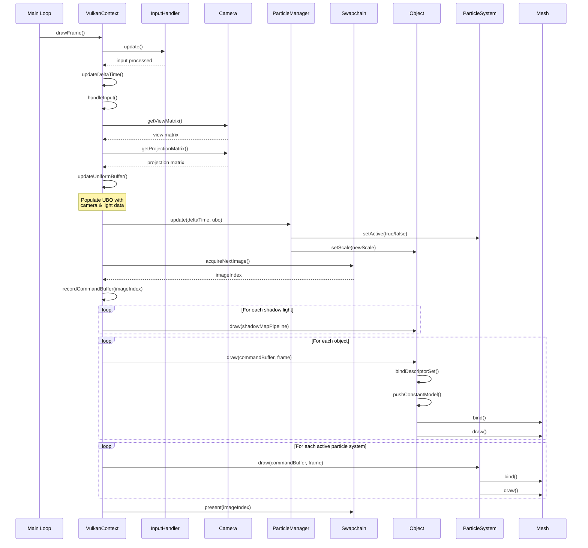
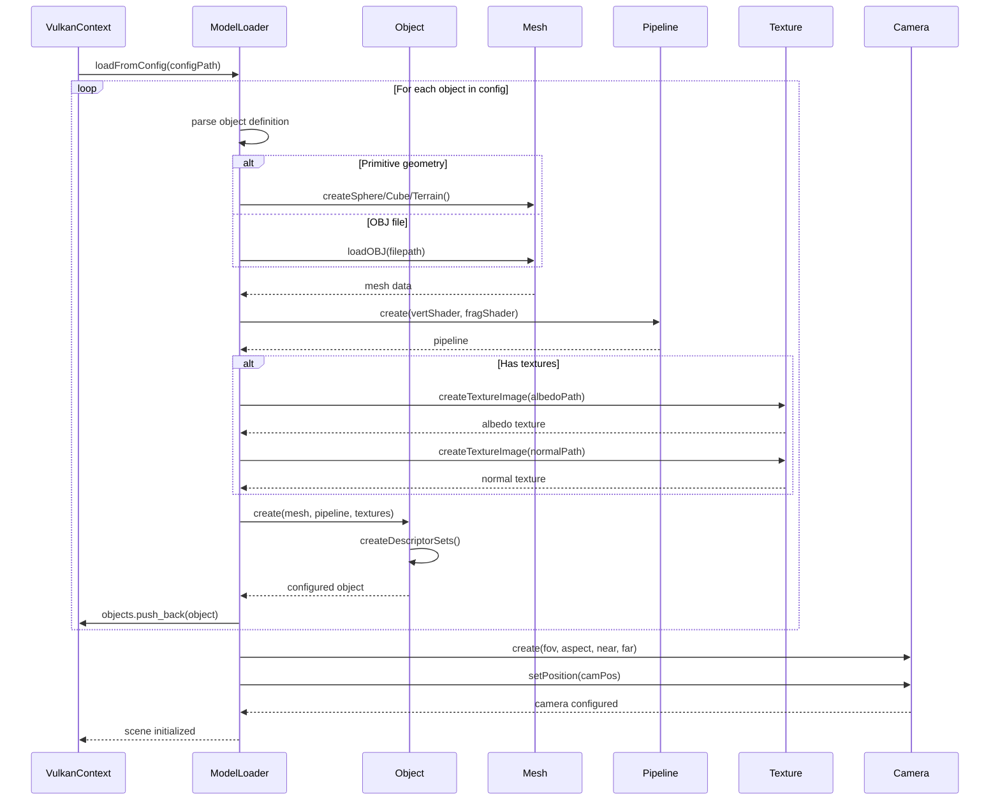
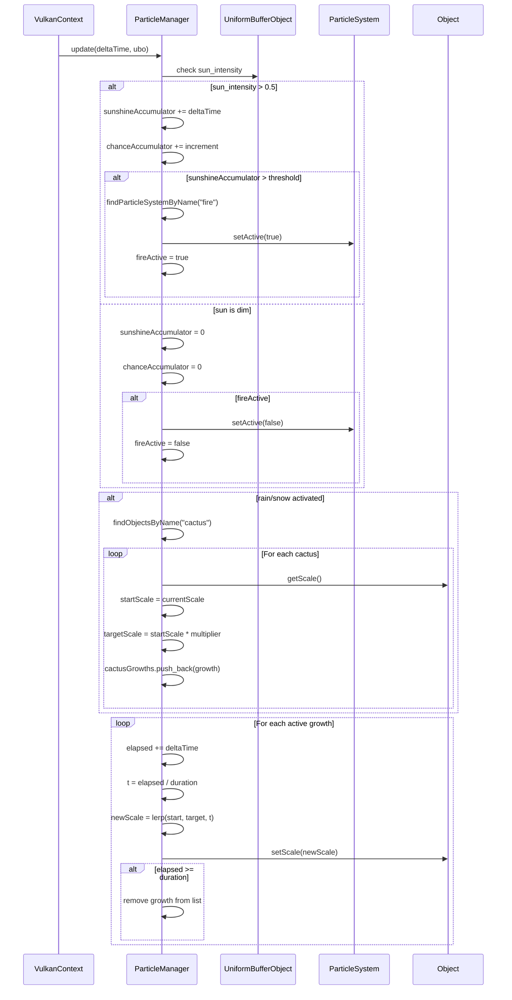

# Design Report (700120)

## Class Descriptions

### Main Classes

**VulkanContext**: The central orchestrator managing the Vulkan rendering lifecycle. Responsible for initializing Vulkan instances, devices, and synchronization primitives; coordinating rendering passes; managing the main render loop; and maintaining collections of renderable objects, particle systems, and lighting sources. Acts as the primary interface between application logic and the graphics API.

**Object**: Represents a renderable game entity combining geometry, materials, and transformation data. Responsible for encapsulating mesh geometry, rendering pipeline configuration, texture resources (albedo and normal maps), spatial transformation (position, rotation, scale), and descriptor set management for shader resource binding. Provides drawing functionality and uniform buffer updates.

**Mesh**: Encapsulates geometric data for rendering. Responsible for storing CPU-side vertex and index arrays, managing GPU-side vertex and index buffers, providing buffer binding operations, and supporting both indexed and non-indexed rendering modes. Offers static factory methods for deep copying mesh data.

**Pipeline**: Configures the graphics rendering pipeline state. Responsible for shader module creation and management, pipeline layout definition including descriptor sets and push constants, rasterization state configuration (culling, depth testing), and managing dynamic state (viewport, scissor). Base class for specialized pipeline types.

**Camera**: Manages view and projection transformations for rendering scenes. Responsible for computing view matrices from position and orientation, generating perspective or orthographic projection matrices, providing camera movement controls (forward, right, up), handling rotation via yaw and pitch, and maintaining view frustum parameters (FOV, aspect ratio, near/far planes).

**ParticleSystem**: Manages simulation and rendering of particle-based visual effects. Responsible for particle geometry updates, particle pipeline management, descriptor set configuration for particle shaders, spatial transformation of particle emitters, and controlling activation/deactivation of effects. Supports named particle systems for runtime querying.

**Texture**: Encapsulates image resources for material properties. Responsible for managing Vulkan image and memory handles, providing multiple sampler configurations (nearest, bilinear, trilinear, anisotropic), supporting shared ownership of image resources through smart pointers, and offering cloning capabilities for texture reuse.

**LightSource**: Represents dynamic light sources with animation support. Responsible for storing light properties (type, position, color, intensity), supporting directional, point, and spot light types, enabling orbital animation around specified centers, applying light data to uniform buffer objects for shader consumption, and rendering light source representations.

### Service/Utility Classes

**ModelLoader**: Static factory providing geometry generation and asset loading. Responsible for creating procedural primitives (spheres, cubes, toruses, cylinders, terrain grids), loading OBJ model files, generating particle system geometry, loading textures from files or memory, creating various texture samplers, loading cubemaps for skybox and environment mapping, and parsing configuration files to initialize scenes.

**ParticleManager**: Coordinates particle system behavior based on environmental conditions. Responsible for monitoring weather states and triggering appropriate particle effects (rain, snow, fire), managing cactus growth animations in response to environmental triggers, maintaining internal state for precipitation and sunshine tracking, and spawning/despawning particle systems dynamically.

**Buffer**: Wraps Vulkan buffer resources with type-safe operations. Responsible for buffer creation with specified usage flags and memory properties, memory mapping and unmapping for CPU access, buffer copying operations, memory flushing and invalidation, and providing factory methods for vertex, index, and uniform buffers.

**Swapchain**: Manages the presentation chain for displaying rendered images. Responsible for creating and recreating swapchains during window resize, managing swapchain images and image views, depth buffer creation and management, acquiring next available images for rendering, presenting completed frames to the display, and querying swapchain support capabilities.

**Transform**: Simple data structure representing spatial transformations. Responsible for storing position, rotation, and scale vectors, and computing combined model matrices using translation, rotation, and scaling transformations.

**Window**: Wraps GLFW window management. Responsible for window creation and lifecycle management, handling framebuffer resize events, tracking frame indices for synchronization, and providing window state queries (dimensions, should close).

**InputHandler**: Processes user input from keyboard and mouse. Responsible for tracking key and button states (pressed, held, released), capturing mouse position and delta movement, managing scroll wheel input, supporting callback registration for input events, and updating input state each frame.

**SkyboxPipeline**: Specialized pipeline for skybox rendering with depth optimization. Inherits from Pipeline; responsible for configuring depth testing (less-or-equal) to render skybox at maximum depth, disabling culling for inside-out cube rendering, and managing skybox-specific shader stages.

**ParticlePipeline**: Specialized pipeline for particle rendering with transparency. Inherits from Pipeline; responsible for enabling alpha blending for transparent particles, configuring point primitive topology for particle vertices, disabling depth writes to prevent occlusion artifacts, and managing particle-specific shader uniforms.

**ShadowMapPipeline**: Specialized pipeline for shadow map generation. Inherits from Pipeline; responsible for configuring depth-only rendering without color attachments, enabling dynamic depth bias to reduce shadow acne, using front-face culling to improve shadow quality, and supporting high-resolution depth buffer rendering (4096x4096).

## UML Class Diagram

## UML Interaction Diagrams

### Frame Rendering Sequence

### Scene Initialization from Configuration

### Particle System Behavior Management

## Design Critique

### Merits

**Separation of Concerns**: The architecture cleanly separates graphics API interaction (VulkanContext), scene representation (Object, ParticleSystem), geometry management (Mesh), and rendering configuration (Pipeline hierarchy). This modularity enables independent testing and evolution of components.

**Resource Reusability**: Meshes and pipelines can be shared across multiple objects through move semantics, reducing memory footprint and initialization overhead. The Texture cloning mechanism with shared image ownership allows efficient material variations.

**Extensibility via Inheritance**: The Pipeline base class provides a template for specialized rendering paths (skybox, particles, shadows), allowing customized rasterization states and shader configurations while preserving common initialization logic.

**Data-Driven Configuration**: ModelLoader's config file parsing decouples scene composition from code, enabling rapid iteration on object placement, textures, and shaders without recompilation. This supports artist workflows and runtime scene variations.

**Behavioral Composition**: ParticleManager demonstrates event-driven architecture by monitoring environmental state (UBO data) and triggering particle effects and object mutations (cactus growth), enabling emergent behaviors from simple rules.

### Weaknesses

**Manual Memory Management Complexity**: The project mixes RAII (Buffer, Texture shared ownership) with manual cleanup methods (Object::cleanup, Pipeline::destroy), increasing cognitive load and error potential. Inconsistent ownership models risk resource leaks during exception paths. This was done intentionally however, as the unwinding order can change depending on the order variables are declared in. leading to more hidden errors

**Hardcoded Pipeline States**: Pipeline derivatives override create() but lack runtime state modification. Changing culling mode or depth testing post-creation requires pipeline recreation. Supporting dynamic state objects or pipeline variants would enable LOD systems and material property changes.

### Proposed Changes

**Implement Render Queue**: Create a RenderQueue class collecting DrawCommands (mesh, material, transform) sorted by pipeline and material to minimize state changes. VulkanContext would populate and execute the queue per frame, significantly reducing draw call overhead for scenes with shared materials.

**Pipeline State Objects**: Define PipelineState structs capturing culling, depth testing, blending configurations. Pipeline::create() accepts PipelineState, and pipelines cache state variants, enabling runtime material property changes without full recreation. Supports dynamic LOD and transparency sorting.

**Implement Renderer Interface**: Introduce an IRenderer interface to decouple engine logic from the graphics API. Implementations such as VulkanRenderer or DX12Renderer encapsulate all API-specific behaviour (device setup, swapchain, command submission). High-level systems depend only on IRenderer, making backend changes or additions straightforward with minimal refactoring.

---

**Word Count**: 990 words (excluding diagrams)
